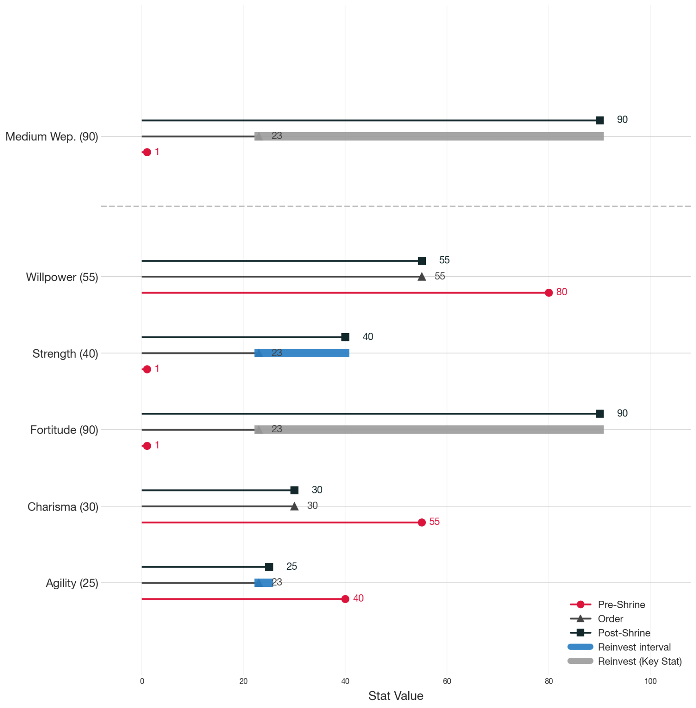

# Analytic Deepwoken (DWIB Build Analytics)

**Analytic Deepwoken** is a Python-based Discord bot for the Deepwoken Institute of Building (DWIB). It provides comprehensive build analytics, lookups for equipment, talents, weapons, outfits, and mantras, along with smart functions for spellcheck and optimization.

---

## Table of Contents

- [Features](#features)
- [Installation](#installation)
- [Configuration](#configuration)
- [Commands](#commands)
  - [General Commands](#general-commands)
  - [Lookup Commands](#lookup-commands)
  - [Analytics](#analytics-commands)
- [Examples](#examples)
- [Contributing](#contributing)
- [License](#license)

---

## Features

- Full build analytics (Effective Health Points, Stat Evolution, Summary)
- Equipment, talent, weapon, outfit, and mantra lookups with fuzzy matching
- Clean, modular codebase for easy extension

---

## Installation

1. Clone the repository:

   ```bash
   git clone https://github.com/miljyface/analytic-deepwoken.git
   cd analytic-deepwoken
   ```

2. Create and activate a virtual environment:

   ```bash
   python3 -m venv venv
   source venv/bin/activate  # macOS/Linux
   venv\\Scripts\\activate  # Windows
   ```

3. Install dependencies:

   ```bash
   pip install -r requirements.txt
   ```

---

## Configuration

1. Create a `.env` file in the project root with your Discord bot token:

   ```dotenv
    BOT_TOKEN = TOKEN HERE
    DATABASE_KEY= ACCESS KEY HERE
    DATABASE_URL = https://idyjvmmldtdvpklkzrgr.supabase.co
   ```

2. Start the bot:

   ```bash
   python src/bot.py
   ```

---

## Commands

### General Commands

| Command        | Description                                  |
| -------------- | -------------------------------------------- |
| `.help`        |     Displays a help menu                     |

### Lookup Commands

| Command                     | Description                                  |
| --------------------------- | -------------------------------------------- |
| `.equipment <name>`   | Lookup Equipment details                     |
| `.talent <name>`      | Lookup Talent details                        |
| `.weapon <name>`      | Lookup Weapon details                        |
| `.outfit <name>`      | Lookup Outfit details                        |
| `.mantra <name>`      | Lookup Mantra details                        |

### Analytics Commands

| Reply to Build Link         | Description                                          |
| --------------------------- | ---------------------------------------------------- |
| `ehp`.                      | Calculates Effective Health Points of a full Phys and HP kit |
| `stats`.                    | Displays the Stat Evolution diagram for visualisation of optimisation |
| `validate`.                 | Validates the build against the Deepleague Rulebook |

Please refer to [Interpretations](#interpretations) for a general guide on how to read the analytics.

---

## Interpretations



This graph is separated into three segments, **Attunement**, **Weapon**, and **Base**. Each segment contains non-zero stat categories, with three stems to each category, the magnitude of the stems denoting the investment.

- **Red**: Pre-Shrine
- **Gray**: Immediately after Shrine of Order
- **Black**: Post-Shrine

For stats that are not required reinvestments (Fortitude, Weapons, Attunements), a blue bar will be drawn between the **Gray** apex and the **Black** apex, denoting the **Reinvestment Interval**. For key stats, this interval will be gray instead.

The total blue on the graph is the amount of points that you have returned after using Shrine of Order. Builds with more blue usually means an unoptimal build, but this is not concrete.


This graph breaks down your build health to its components and scales them with the following flags:

- **RA Effectiveness (0-30)**
- **TTF Effectiveness (0-10)**
- **CCharm Effectiveness (0-~12.5)**
- **Permanent Reinforce (True/False)**

The EHP testing scenarios are as follows:

- **100 Enemy DPS**
- **50% Enemy PEN**
- Phys Kit: **112HP, 33% Phys from pips**
- HP Kit: **154HP, 4% Phys from pips**

For transparency, this is the assumed kit for the ehp calculation.

Phys:

- **Parasol Planter: 9hp 12%phys (1 rare hp, 4 rare phys, 1 leg phys)**
- **Bastions of Enmity: 17hp 18%phys (1 rare hp, 1 rare phys, 4 leg phys)**
- **Confessor's Charm: 13hp 3%phys (1 rare eth, 2 rare hp, 1 leg hp)**

HP:

- **Parasol Planter: 26hp 2%phys (1 rare phys, 4 rare hp, 1 leg hp)**
- **Bastions of Enmity: 37hp 2%phys (1 rare phys, 1 rare hp, 4 leg hp)**
- **Fauld of Enmity: 18hp 0%phys (1 rare eth, 2 rare hp, 2 leg hp)**

Constant:

- Star Boots: 30hp
- Moonlit Earrings: 2hp
- Citadel Frames: 5hp
- 4x Moon/Waning: 36hp

---

## Examples

- **Lookup Mantra (proper)**:  `.weapon Champion's Sword`
- **Lookup Weapon (substring search)**:  `.weapon n's swor`
- **Lookup Weapon (spellcheck)**: `.weapon gale hb`
- **Analyze Build EHP**: `(replying to build link) ehp`

---

## Contributing

Contributions are welcome! Please open an issue or submit a pull request for enhancements, bug fixes, or new features.
